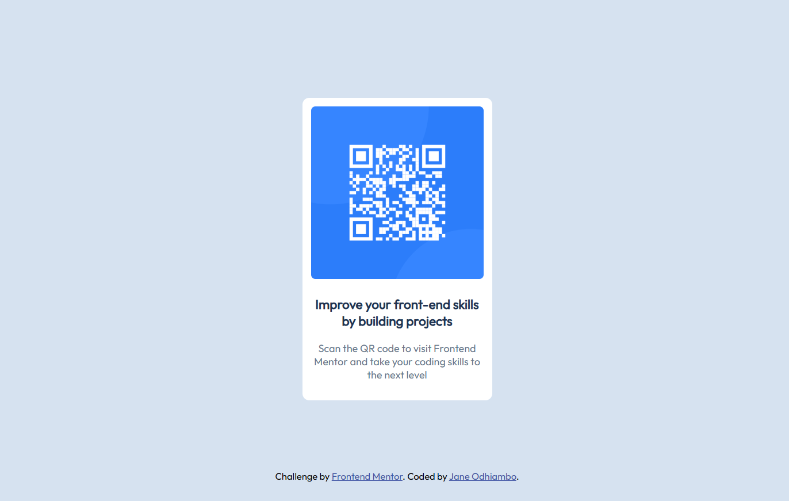

# Frontend Mentor - QR code component solution

This is a solution to the [QR code component challenge on Frontend Mentor](https://www.frontendmentor.io/challenges/qr-code-component-iux_sIO_H). Frontend Mentor challenges help you improve your coding skills by building realistic projects. 

## Table of contents

- [Overview](#overview)
  - [Screenshot](#screenshot)
    - [Desktop View](#desktop-view)
    - [Mobile View](#mobile-view)
  - [Links](#links)
- [My process](#my-process)
  - [Built with](#built-with)
  - [What I learned](#what-i-learned)
  - [Continued development](#continued-development)
- [Author](#author)

## Overview

### Screenshot

#### Desktop View

#### Mobile View

### Links

- [Solution URL](https://github.com/Janespot/qr-code-component-main/)
- [Live Site URL](https://janespot.github.io/qr-code-component-main/)

## My process

### Built with

- Semantic HTML5 markup
- CSS custom properties
- media queries
- Mobile-first workflow

### What I learned

I have learned how to deploy web page with GitHub pages.

### Continued development

I would like to learn how to deploy pages with Vercel and Netlify.
I would also like to learn Figma for web design.

## Author

- Website - [Jane Odhiambo](https://janespot.github.io/)
- Frontend Mentor - [@Janespot](https://www.frontendmentor.io/profile/Janespot)
- Twitter - [@Janejunell777](https://x.com/Janejunell777)